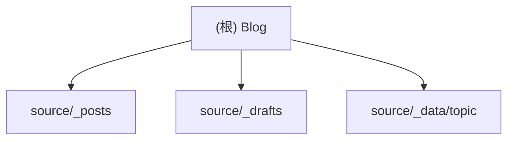

# CLAUDE.md

This file provides guidance to Claude Code (claude.ai/code) when working with code in this repository.

## Project Overview

This is a Hexo-based static blog site in Chinese, deployed to GitHub Pages. The blog focuses on technical topics (Angular, TypeScript, frontend development) and personal writings.

## Common Commands

### Development
- `npm run server` - Start local dev server with draft support (http://localhost:4000)
- `npm run clean` - Clean generated files and cache
- `npm run build` - Generate static files for deployment
- `npm run deploy` - Deploy to GitHub Pages (caoxicheng.github.io, blog branch)

### Creating Content
- `hexo new "My New Post"` - Create a new post
- `hexo new draft "My Draft"` - Create a new draft
- `hexo publish "My Draft"` - Publish a draft to posts

## Architecture

### Content Structure
- `/source/_posts/` - Published blog posts in Markdown format
- `/source/_drafts/` - Draft posts not yet published
- `/source/_data/topic/` - Topic/category definitions in YAML
- Post assets are stored in folders with the same name as the post

### Key Configuration
- Theme: Stellar (configured in _config.stellar.yml)
- Comments: Giscus integration for GitHub-based comments
- Search: Local search functionality enabled
- Deployment: GitHub Pages via git deployer
- Permalinks: Uses pinyin conversion for Chinese titles

### Writing Posts
- Posts support front matter with title, date, tags, topic, cover
- Asset folders are automatically created for each post to store images/files
- Images should be referenced relatively from within post folders

## 初始化架构分析报告 (2025-09-02)

### 模块结构图

### 模块索引
| 模块路径 | 一句话职责 |
|---------|-----------|
| source/_posts | 存放已发布的博客文章 |
| source/_drafts | 存放未发布的博客草稿 |
| source/_data/topic | 存放博客主题/分类定义 |

### 变更记录 (Changelog)
- 2025-09-02: 初始化架构分析，生成基础 CLAUDE.md 结构和模块文档