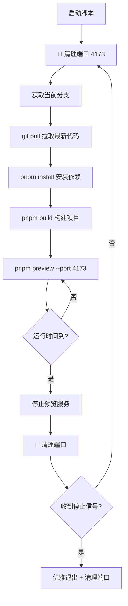

# 自动化测试环境部署脚本实践

## 📌 背景介绍

在日常开发工作中，我经常需要为测试同学提供临时的测试环境。传统的流程是这样的：

1. 手动执行 `git pull` 拉取最新代码
2. 运行 `pnpm install` 安装依赖
3. 执行 `pnpm build` 构建项目
4. 启动 `pnpm preview` 在新端口预览
5. 等待测试完成后手动停止

这个过程有几个明显的痛点：

- 🔄 **重复劳动**：每次更新都需要手动执行这一套流程
- ⏰ **时间消耗**：需要频繁关注部署状态，打断正常开发节奏
- 🐛 **容易出错**：可能忘记拉取最新代码或构建失败后没及时发现
- 💻 **资源占用**：预览服务长时间运行，占用本地资源

## 🎯 需求分析

理想的解决方案应该满足以下需求：

### 核心功能

1. **自动更新代码**：定时从远程仓库拉取最新代码
2. **自动构建部署**：自动完成依赖安装和项目构建
3. **定时重启**：预览服务运行一定时间后自动重启，避免资源浪费
4. **优雅退出**：支持手动终止，自动清理子进程

### 技术要点

- 跨平台兼容（macOS、Linux、Windows）
- 子进程管理和信号处理
- 错误处理和自动重试
- 日志输出便于调试

## 💡 解决方案

基于以上需求，我使用 Node.js 编写了一个自动化部署脚本。选择 Node.js 的原因：

1. 前端项目本身就依赖 Node 环境，无需额外安装
2. `child_process` 模块提供了强大的进程管理能力
3. 跨平台支持良好
4. 代码简洁易维护

## 🚀 脚本实现

### 核心功能模块

#### 1. 跨平台命令执行

```javascript
function runCmd(cmd, args = [], options = {}) {
  return new Promise((resolve, reject) => {
    const child = spawn(cmd, args, {
      stdio: 'inherit',
      shell: true, // 统一使用 shell 模式
      ...options,
    });

    child.on('error', reject);
    child.on('exit', (code) => {
      if (code === 0) resolve();
      else reject(new Error(`${cmd} ${args.join(' ')} exited with code ${code}`));
    });
  });
}
```

**设计要点**：
- 统一使用 `shell: true` 简化跨平台处理
- `stdio: 'inherit'` 让子进程输出直接显示在控制台
- Promise 封装便于 async/await 调用

#### 2. 获取当前分支

```javascript
function getCurrentBranch() {
  return execSync('git rev-parse --abbrev-ref HEAD').toString().trim();
}
```

**设计要点**：
- 使用 `execSync` 简化同步获取分支名的逻辑
- 直接返回字符串结果，代码更简洁

#### 3. 端口清理功能 ⭐ 新增

```javascript
function killPort(port) {
  try {
    if (os.platform() === 'win32') {
      execSync(`for /f "tokens=5" %a in ('netstat -ano ^| find ":${port}" ^| find "LISTENING"') do taskkill /PID %a /F`);
    } else {
      execSync(`lsof -ti:${port} | xargs kill -9`, { stdio: 'ignore' });
    }
    console.log(`[${now()}] 🧹 清理端口 ${port} 成功`);
  } catch {
    // 没有残留进程，忽略错误
  }
}
```

**设计要点**：
- **解决核心痛点**：预览进程异常退出时，端口可能被占用导致下次启动失败
- Windows 平台：使用 `netstat` + `taskkill` 组合清理
- Unix 平台：使用 `lsof` + `kill -9` 强制清理
- 每轮循环开始前主动清理，确保端口可用
- 捕获异常避免无进程时报错

#### 4. 优雅终止预览进程

```javascript
function stopPreview(proc) {
  return new Promise((resolve) => {
    if (!proc || proc.killed) return resolve();
    try {
      proc.kill('SIGINT');
      setTimeout(() => {
        try { proc.kill('SIGKILL'); } catch {}
        resolve();
      }, 1500);
    } catch {
      resolve();
    }
  });
}
```

**设计要点**：
- 优先使用 `SIGINT` 信号（等价于 Ctrl+C），让进程有机会优雅退出
- 1.5 秒后使用 `SIGKILL` 兜底，确保进程一定会被终止
- 代码简化，统一处理逻辑

#### 5. 定时运行预览服务（带端口管理）

```javascript
function runPreviewFor(durationMs) {
  return new Promise((resolve, reject) => {
    console.log(`[${now()}] ▶️ pnpm preview (端口 ${PREVIEW_PORT}, 将在 ${PREVIEW_MINUTES} 分钟后自动关闭)`);

    // 明确指定端口
    previewProc = spawn('pnpm', ['preview', '--', '--port', String(PREVIEW_PORT)], {
      stdio: 'inherit',
      shell: true
    });

    const timer = setTimeout(async () => {
      console.log(`\n[${now()}] ⏱️ 时间到，关闭 preview...`);
      await stopPreview(previewProc);
      killPort(PREVIEW_PORT); // 清理端口
      resolve();
    }, durationMs);

    previewProc.on('exit', (code) => {
      clearTimeout(timer);
      killPort(PREVIEW_PORT); // 确保端口被清理
      if (code === 0) resolve();
      else reject(new Error(`preview exited with code ${code}`));
    });
  });
}
```

**设计要点**：
- 使用 `--port` 参数**明确指定端口**，避免随机分配
- 预览结束后立即调用 `killPort()` 清理端口
- 定时器到期和进程退出都会触发端口清理，双重保险

#### 6. 主循环和信号处理

```javascript
async function loop() {
  while (!stopping) {
    try {
      killPort(PREVIEW_PORT); // 每轮开始前清理端口 ⭐
      await pullAndBuild();
      await runPreviewFor(PREVIEW_DURATION_MS);
    } catch (err) {
      console.error(`[${now()}] ❌ Error: ${err.message}`);
      await new Promise((r) => setTimeout(r, 10000));
    }
  }
}

// 处理 Ctrl+C
process.on('SIGINT', async () => {
  stopping = true;
  console.log(`\n[${now()}] 🛑 收到 Ctrl+C，停止中...`);
  await stopPreview(previewProc);
  killPort(PREVIEW_PORT); // 退出时清理端口
  process.exit(0);
});
```

**设计要点**：
- **核心改进**：每轮循环开始前主动清理端口，彻底避免端口占用问题
- 捕获错误后等待 10 秒再重试，避免频繁失败占用资源
- 退出时同步清理端口和进程，确保环境干净

## 📦 使用方法

### 1. 创建脚本文件

在项目根目录创建 `auto-preview.cjs` 文件，复制完整脚本代码。

> 💡 使用 `.cjs` 扩展名确保 CommonJS 模块在任何环境下都能正常运行

### 2. 添加执行权限（Unix 系统）

```bash
chmod +x auto-preview.cjs
```

### 3. 运行脚本

```bash
# 使用默认配置（30分钟循环一次，端口4173）
node auto-preview.cjs

# 自定义预览时长（如15分钟）
PREVIEW_MINUTES=15 node auto-preview.cjs
```

### 4. 添加到 package.json（推荐）

```json
{
  "scripts": {
    "auto-preview": "node auto-preview.cjs",
    "auto-preview:short": "PREVIEW_MINUTES=15 node auto-preview.cjs"
  }
}
```

然后可以使用：

```bash
pnpm auto-preview
```

## 🔍 工作流程

脚本启动后会按以下流程循环执行：



### 实际运行示例

```bash
$ node auto-preview.cjs

[2025-10-22 15:30:00] 🚀 Auto preview started (每 30 分钟循环一次)
[2025-10-22 15:30:00] 🧹 清理端口 4173 成功
[2025-10-22 15:30:00] 🌀 git pull feature/new-ui
Already up to date.
[2025-10-22 15:30:02] 📦 pnpm install
Dependencies are up to date
[2025-10-22 15:30:05] 🛠️ pnpm build
Building for production...
✓ Built in 45s
[2025-10-22 15:30:50] ▶️ pnpm preview (端口 4173, 将在 30 分钟后自动关闭)
> Local: http://localhost:4173/
> Network: http://192.168.1.100:4173/

[2025-10-22 16:00:50] ⏱️ 时间到，关闭 preview...
[2025-10-22 16:00:51] 🧹 清理端口 4173 成功
[2025-10-22 16:00:52] 🧹 清理端口 4173 成功
[2025-10-22 16:00:52] 🌀 git pull feature/new-ui
...
```

## ⚠️ 注意事项

### 1. 端口占用问题（已解决 ✅）

**问题背景**：预览进程异常退出时，端口可能未被正确释放，导致下次启动失败并报错：
```
Error: Port 4173 is already in use
```

**解决方案**：新版脚本通过 `killPort()` 函数自动清理端口：
- ✅ 每轮循环开始前主动清理
- ✅ 预览结束后立即清理
- ✅ 手动退出时同步清理

**手动清理方法**（如需要）：
```bash
# macOS/Linux
lsof -ti:4173 | xargs kill -9

# Windows
netstat -ano | findstr :4173
taskkill /PID <进程ID> /F
```

**自定义端口**：如需修改默认端口 4173，在脚本中更改：
```javascript
const PREVIEW_PORT = 5000; // 修改为你想要的端口
```

### 2. Git 冲突处理

如果本地有未提交的修改，`git pull` 可能会失败。

**推荐做法**：
```bash
# 在脚本运行前提交或暂存本地修改
git stash
node auto-preview.cjs
```

**或者修改脚本**，使用 `git pull --rebase --autostash` 自动处理：

```javascript
async function pullAndBuild() {
  const branch = getCurrentBranch();
  console.log(`[${now()}] 🌀 git pull ${branch}`);
  await runCmd('git', ['pull', '--rebase', '--autostash', 'origin', branch]);
  // ...
}
```

### 3. 资源占用

- 构建过程会占用较多 CPU 和内存
- 建议在非高峰时段或独立机器上运行
- 可以调整 `PREVIEW_MINUTES` 参数平衡更新频率和资源占用

### 4. 错误处理

脚本会在出错后等待 10 秒自动重试。常见错误：

- **网络问题**：`git pull` 失败 → 检查网络连接和 Git 配置
- **依赖安装失败**：`pnpm install` 报错 → 清理 `node_modules` 重试
- **构建失败**：`pnpm build` 失败 → 检查代码是否有语法错误

## 🎨 扩展思路

这个脚本是一个基础框架，可以根据实际需求扩展：

### 1. 添加通知功能

构建完成后发送通知（钉钉、企业微信等）：

```javascript
async function sendNotification(message) {
  const https = require('https');
  const postData = JSON.stringify({
    msgtype: 'text',
    text: { content: message }
  });

  // 钉钉机器人 Webhook
  const options = {
    hostname: 'oapi.dingtalk.com',
    path: '/robot/send?access_token=YOUR_TOKEN',
    method: 'POST',
    headers: { 'Content-Type': 'application/json' }
  };

  return new Promise((resolve, reject) => {
    const req = https.request(options, (res) => {
      res.on('end', resolve);
    });
    req.on('error', reject);
    req.write(postData);
    req.end();
  });
}

async function loop() {
  while (!stopping) {
    try {
      killPort(PREVIEW_PORT);
      await pullAndBuild();
      await sendNotification(`✅ 测试环境已更新 (端口 ${PREVIEW_PORT})，可以开始测试`);
      await runPreviewFor(PREVIEW_DURATION_MS);
    } catch (err) {
      await sendNotification(`❌ 部署失败: ${err.message}`);
      console.error(`[${now()}] ❌ Error: ${err.message}`);
      await new Promise((r) => setTimeout(r, 10000));
    }
  }
}
```

### 2. 多分支支持

支持同时运行多个分支的预览：

```javascript
const BRANCHES = [
  { name: 'feature/new-ui', port: 4173 },
  { name: 'feature/payment', port: 4174 },
  { name: 'develop', port: 4175 }
];

function runBranchLoop(branch, port) {
  // 为每个分支创建独立的工作目录和预览进程
  const workDir = `./preview-${branch.name.replace(/\//g, '-')}`;
  // ... 实现逻辑
}

BRANCHES.forEach(b => runBranchLoop(b.name, b.port));
```

### 3. Docker 集成

将预览服务容器化，更好地隔离和管理：

```dockerfile
FROM node:18
WORKDIR /app
COPY . .
RUN pnpm install && pnpm build
CMD ["pnpm", "preview"]
```

### 4. 日志持久化

将日志输出到文件，便于追溯问题：

```javascript
const fs = require('fs');
const logFile = fs.createWriteStream('auto-preview.log', { flags: 'a' });

console.log = (...args) => {
  const message = args.join(' ');
  process.stdout.write(message + '\n');
  logFile.write(`[${new Date().toISOString()}] ${message}\n`);
};
```

## 💪 实践效果

使用这个自动化脚本后，我的工作流程发生了显著变化：

### 优化前
- ⏰ 每次手动部署耗时约 **5-10 分钟**
- 🔄 一天需要部署 **3-5 次**
- 😓 总计浪费 **15-50 分钟**
- 🐛 偶尔忘记更新代码，测试同学测到旧版本

### 优化后
- ✅ 脚本自动运行，**零人工介入**
- 🚀 测试环境始终保持最新
- ⏱️ 节省 **100%** 的手动部署时间
- 💯 避免人为失误，提升测试效率

## 🎯 总结

这个自动化部署脚本虽然只有 **130 行代码**，但实实在在地解决了日常开发中的痛点：

### 核心价值

- 🔄 **自动化循环**：无需人工干预，自动拉取、构建、部署
- 🧹 **端口管理**：自动清理端口，彻底解决"端口被占用"问题（⭐ 新增）
- 🔧 **灵活配置**：通过环境变量调整运行参数
- 🌍 **跨平台支持**：macOS、Linux、Windows 均可运行
- 🛡️ **健壮性**：错误自动重试、优雅退出、端口自动清理

### 关键创新点

1. **主动式端口管理**：每轮循环开始前主动清理端口，而不是被动等待端口释放
2. **代码简化**：使用 `execSync` 简化同步操作，代码更简洁
3. **双重保险**：进程退出和定时器到期都会清理端口
4. **明确端口指定**：使用 `--port` 参数固定端口，避免随机分配

更重要的是，这个脚本展示了一种思维方式：**当你发现自己在重复做同一件事时，思考一下能否用代码自动化**。

自动化不仅是提升效率的手段，更是一种工程师文化。希望这个小工具能给你带来启发！

## 🔗 相关资源

- [Node.js child_process 文档](https://nodejs.org/api/child_process.html)
- [Vite Preview 配置](https://vitejs.dev/config/preview-options.html)
- [Git 命令参考](https://git-scm.com/docs)
- [pnpm 官方文档](https://pnpm.io/)

---

## 完整脚本代码

```javascript
#!/usr/bin/env node
/**
 * auto-preview.cjs
 * 自动循环构建 & 预览，确保端口清理
 */

const { spawn } = require('child_process');
const os = require('os');
const { execSync } = require('child_process');

const PREVIEW_PORT = 4173; // 默认 vite preview 端口
const PREVIEW_MINUTES = Number(process.env.PREVIEW_MINUTES || 30);
const PREVIEW_DURATION_MS = PREVIEW_MINUTES * 60 * 1000;

let previewProc = null;
let stopping = false;

function now() {
  return new Date().toLocaleString();
}

function runCmd(cmd, args = [], options = {}) {
  return new Promise((resolve, reject) => {
    const child = spawn(cmd, args, {
      stdio: 'inherit',
      shell: true,
      ...options,
    });
    child.on('error', reject);
    child.on('exit', (code) => {
      if (code === 0) resolve();
      else reject(new Error(`${cmd} ${args.join(' ')} exited with code ${code}`));
    });
  });
}

// ✅ 获取当前分支
function getCurrentBranch() {
  return execSync('git rev-parse --abbrev-ref HEAD').toString().trim();
}

// ✅ 强制清理端口（杀残留 vite preview）
function killPort(port) {
  try {
    if (os.platform() === 'win32') {
      execSync(`for /f "tokens=5" %a in ('netstat -ano ^| find ":${port}" ^| find "LISTENING"') do taskkill /PID %a /F`);
    } else {
      execSync(`lsof -ti:${port} | xargs kill -9`, { stdio: 'ignore' });
    }
    console.log(`[${now()}] 🧹 清理端口 ${port} 成功`);
  } catch {
    // 没有残留进程
  }
}

// ✅ 停止 preview 进程
function stopPreview(proc) {
  return new Promise((resolve) => {
    if (!proc || proc.killed) return resolve();
    try {
      proc.kill('SIGINT');
      setTimeout(() => {
        try { proc.kill('SIGKILL'); } catch {}
        resolve();
      }, 1500);
    } catch {
      resolve();
    }
  });
}

// ✅ 拉取 & 构建
async function pullAndBuild() {
  const branch = getCurrentBranch();
  console.log(`[${now()}] 🌀 git pull ${branch}`);
  await runCmd('git', ['pull', 'origin', branch]);
  console.log(`[${now()}] 📦 pnpm install`);
  await runCmd('pnpm', ['install']);
  console.log(`[${now()}] 🛠️ pnpm build`);
  await runCmd('pnpm', ['build']);
}

// ✅ 运行 preview
function runPreviewFor(durationMs) {
  return new Promise((resolve, reject) => {
    console.log(`[${now()}] ▶️ pnpm preview (端口 ${PREVIEW_PORT}, 将在 ${PREVIEW_MINUTES} 分钟后自动关闭)`);
    previewProc = spawn('pnpm', ['preview', '--', '--port', String(PREVIEW_PORT)], { stdio: 'inherit', shell: true });

    const timer = setTimeout(async () => {
      console.log(`\n[${now()}] ⏱️ 时间到，关闭 preview...`);
      await stopPreview(previewProc);
      killPort(PREVIEW_PORT);
      resolve();
    }, durationMs);

    previewProc.on('exit', (code) => {
      clearTimeout(timer);
      killPort(PREVIEW_PORT);
      if (code === 0) resolve();
      else reject(new Error(`preview exited with code ${code}`));
    });
  });
}

// ✅ 主循环
async function loop() {
  while (!stopping) {
    try {
      killPort(PREVIEW_PORT); // ⬅ 每轮开始前清理端口
      await pullAndBuild();
      await runPreviewFor(PREVIEW_DURATION_MS);
    } catch (err) {
      console.error(`[${now()}] ❌ Error: ${err.message}`);
      await new Promise((r) => setTimeout(r, 10000));
    }
  }
}

// ✅ 退出处理
process.on('SIGINT', async () => {
  stopping = true;
  console.log(`\n[${now()}] 🛑 收到 Ctrl+C，停止中...`);
  await stopPreview(previewProc);
  killPort(PREVIEW_PORT);
  process.exit(0);
});

console.log(`[${now()}] 🚀 Auto preview started (每 ${PREVIEW_MINUTES} 分钟循环一次)`);
loop();
```

---

*💡 提示：这篇文章的脚本也是通过 AI 辅助编写的，展示了 AI 在提升开发效率方面的巨大潜力。*
