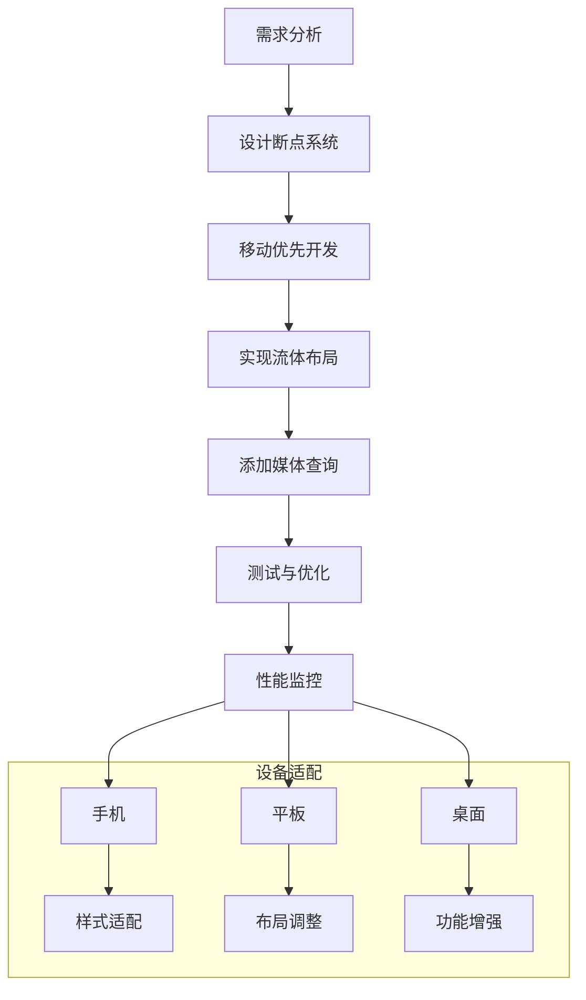

## 引言

随着移动设备的普及，用户通过手机、平板、桌面电脑等多种设备访问网站已成为常态。响应式设计（Responsive Web Design）不再是可选功能，而是现代Web开发的基本要求。根据StatCounter数据，移动设备流量已占全球互联网流量的近60%，这使得响应式设计变得至关重要。

## 响应式设计核心原理

### 三大支柱

1. **流体网格（Fluid Grids）** - 使用相对单位而非固定像素
2. **弹性图片（Flexible Images）** - 图片随容器大小自适应
3. **媒体查询（Media Queries）** - 根据设备特性应用不同样式

### 响应式设计工作流程



## CSS媒体查询深入解析

### 基础媒体查询语法

```css
/* 最小宽度查询（移动优先） */
@media (min-width: 768px) {
  .container {
    max-width: 720px;
  }
}

@media (min-width: 992px) {
  .container {
    max-width: 960px;
  }
}

@media (min-width: 1200px) {
  .container {
    max-width: 1140px;
  }
}

/* 最大宽度查询（桌面优先） */
@media (max-width: 767px) {
  .mobile-menu {
    display: block;
  }
}
```

### 现代媒体查询特性

```css
/* 设备像素比查询 */
@media (-webkit-min-device-pixel-ratio: 2), (min-resolution: 192dpi) {
  .high-dpi-image {
    background-image: url('image@2x.jpg');
  }
}

/* 深色模式支持 */
@media (prefers-color-scheme: dark) {
  :root {
    --bg-color: #1a1a1a;
    --text-color: #ffffff;
  }
}

/* 减少动画偏好 */
@media (prefers-reduced-motion: reduce) {
  * {
    animation-duration: 0.01ms !important;
    animation-iteration-count: 1 !important;
    transition-duration: 0.01ms !important;
  }
}
```

## 现代布局技术

### Flexbox 响应式布局

```css
.container {
  display: flex;
  flex-wrap: wrap;
  gap: 1rem;
}

.item {
  flex: 1 1 300px; /* 基础300px，可伸缩 */
  min-width: 0; /* 防止内容溢出 */
}

/* 小屏幕调整 */
@media (max-width: 768px) {
  .item {
    flex: 1 1 100%; /* 单列布局 */
  }
  
  .container {
    flex-direction: column;
  }
}
```

### CSS Grid 响应式布局

```css
.grid-container {
  display: grid;
  grid-template-columns: repeat(auto-fit, minmax(250px, 1fr));
  gap: 1rem;
  align-items: start;
}

/* 复杂网格布局 */
@media (min-width: 1024px) {
  .grid-container {
    grid-template-columns: 1fr 2fr 1fr;
    grid-template-areas: 
      "header header header"
      "sidebar main aside"
      "footer footer footer";
  }
  
  .header { grid-area: header; }
  .sidebar { grid-area: sidebar; }
  .main { grid-area: main; }
  .aside { grid-area: aside; }
  .footer { grid-area: footer; }
}
```

### 容器查询（Container Queries）

```css
.card-container {
  container-type: inline-size;
  container-name: card;
}

.card {
  display: flex;
  flex-direction: column;
}

/* 基于容器宽度的样式 */
@container card (min-width: 400px) {
  .card {
    flex-direction: row;
    gap: 1rem;
  }
  
  .card-image {
    flex: 0 0 150px;
  }
}

@container card (min-width: 600px) {
  .card {
    align-items: center;
  }
  
  .card-content {
    flex: 1;
  }
}
```

## 响应式单位系统

### 相对单位使用指南

```css
:root {
  /* 根元素字体大小（响应式基础） */
  font-size: 16px;
  
  /* 设计系统变量 */
  --spacing-xs: 0.5rem;    /* 8px */
  --spacing-sm: 1rem;      /* 16px */
  --spacing-md: 1.5rem;    /* 24px */
  --spacing-lg: 2rem;      /* 32px */
  --spacing-xl: 3rem;      /* 48px */
  
  /* 响应式字体大小 */
  --font-size-sm: clamp(0.875rem, 2.5vw, 1rem);
  --font-size-md: clamp(1rem, 3vw, 1.25rem);
  --font-size-lg: clamp(1.25rem, 4vw, 1.5rem);
}

.container {
  padding: var(--spacing-md);
  
  /* 使用clamp函数实现响应式字体 */
  font-size: clamp(1rem, 2.5vw, 1.25rem);
  
  /* 最小高度确保内容可见 */
  min-height: max(50vh, 400px);
}

/* 视口单位的使用 */
.hero-section {
  height: 100vh; /* 全屏高度 */
  width: 100vw;  /* 全屏宽度 */
  margin-left: calc(-50vw + 50%); /* 居中技巧 */
}
```

## 响应式图片优化

### 现代图片解决方案

```html
<!-- srcset 和 sizes 属性 -->


<!-- picture 元素多格式支持 -->
<picture>
  <!-- AVIF格式（现代浏览器） -->
  <source 
    type="image/avif" 
    srcset="/images/photo.avif 1x,
            /images/photo@2x.avif 2x"
  >
  <!-- WebP格式（广泛支持） -->
  <source 
    type="image/webp" 
    srcset="/images/photo.webp 1x,
            /images/photo@2x.webp 2x"
  >
  <!-- 传统格式（回退方案） -->
  
</picture>
```

### CSS中的响应式背景图

```css
.hero-banner {
  background-image: url('/images/banner-small.jpg');
  
  /* 响应式背景图 */
  @media (min-width: 768px) {
    background-image: url('/images/banner-medium.jpg');
  }
  
  @media (min-width: 1200px) {
    background-image: url('/images/banner-large.jpg');
  }
  
  /* 现代背景图技术 */
  background-image: 
    image-set(
      url('/images/banner.avif') type('image/avif'),
      url('/images/banner.webp') type('image/webp'),
      url('/images/banner.jpg') type('image/jpeg')
    );
}
```

## 性能优化策略

### 条件加载和懒加载

```javascript
// 基于网络条件的加载
if (navigator.connection && 
    navigator.connection.saveData === true) {
  // 节省数据模式，加载轻量资源
  loadLightweightAssets();
} else {
  // 正常加载
  loadFullAssets();
}

// 基于设备能力的加载
const isMobile = window.matchMedia('(max-width: 768px)').matches;
const isRetina = window.matchMedia('(-webkit-min-device-pixel-ratio: 2)').matches;

if (isMobile && isRetina) {
  // 移动设备Retina屏幕
  loadOptimizedMobileAssets();
}

// Intersection Observer 懒加载
const lazyImages = document.querySelectorAll('img[data-src]');

const imageObserver = new IntersectionObserver((entries, observer) => {
  entries.forEach(entry => {
    if (entry.isIntersecting) {
      const img = entry.target;
      img.src = img.dataset.src;
      img.removeAttribute('data-src');
      observer.unobserve(img);
    }
  });
});

lazyImages.forEach(img => imageObserver.observe(img));
```

### 响应式JavaScript

```javascript
// 媒体查询在JavaScript中的使用
const mediaQuery = window.matchMedia('(min-width: 1024px)');

function handleTabletChange(e) {
  if (e.matches) {
    // 桌面端逻辑
    initDesktopFeatures();
  } else {
    // 移动端逻辑
    initMobileFeatures();
  }
}

// 初始检查
handleTabletChange(mediaQuery);

// 监听变化
mediaQuery.addEventListener('change', handleTabletChange);

// 基于容器查询的JavaScript
const container = document.querySelector('.card-container');

function checkContainerSize() {
  const width = container.offsetWidth;
  
  if (width >= 600) {
    container.classList.add('large-layout');
    container.classList.remove('small-layout');
  } else {
    container.classList.add('small-layout');
    container.classList.remove('large-layout');
  }
}

// 使用ResizeObserver监听容器大小变化
const resizeObserver = new ResizeObserver(entries => {
  for (const entry of entries) {
    checkContainerSize();
  }
});

resizeObserver.observe(container);
```

## 最佳实践

### 移动优先设计策略

```css
/* 基础样式（移动端） */
body {
  font-size: 16px;
  line-height: 1.5;
  padding: 1rem;
}

.navigation {
  display: flex;
  flex-direction: column;
  gap: 0.5rem;
}

/* 平板设备增强 */
@media (min-width: 768px) {
  body {
    padding: 2rem;
  }
  
  .navigation {
    flex-direction: row;
    gap: 1rem;
  }
}

/* 桌面设备增强 */
@media (min-width: 1024px) {
  .container {
    max-width: 1200px;
    margin: 0 auto;
  }
  
  .navigation {
    gap: 2rem;
  }
}
```

### 断点系统设计

```css
/* 基于内容的断点系统 */
:root {
  --breakpoint-mobile: 320px;
  --breakpoint-tablet: 768px;
  --breakpoint-desktop: 1024px;
  --breakpoint-wide: 1440px;
}

/* 使用自定义属性 */
@media (min-width: var(--breakpoint-tablet)) {
  /* 平板样式 */
}

@media (min-width: var(--breakpoint-desktop)) {
  /* 桌面样式 */
}

/* 组件级断点 */
.component {
  /* 基础样式 */
}

@container (min-width: 300px) {
  .component {
    /* 组件在宽容器中的样式 */
  }
}
```

### 无障碍访问考虑

```css
/* 响应式无障碍设计 */
@media (prefers-reduced-motion: reduce) {
  * {
    animation-duration: 0.01ms !important;
    transition-duration: 0.01ms !important;
  }
}

@media (prefers-contrast: high) {
  :root {
    --text-color: #000000;
    --bg-color: #ffffff;
    --border-color: #000000;
  }
}

/* 确保可点击区域大小 */
.button {
  min-width: 44px;
  min-height: 44px;
  padding: 0.5rem 1rem;
}

@media (max-width: 768px) {
  .button {
    min-width: 48px; /* 移动端更大的点击区域 */
    min-height: 48px;
  }
}
```

## 工具和调试

### 开发工具推荐

```bash
# 浏览器响应式设计模式
# Chrome DevTools → Toggle Device Toolbar
# Firefox → Responsive Design Mode

# 在线测试工具
# - BrowserStack
# - LambdaTest
# - Responsive Design Checker

# 构建工具插件
# - postcss-preset-env (支持现代CSS)
# - purgecss (移除未使用的CSS)
# - critical (提取关键CSS)
```

### 性能监控

```javascript
// 布局偏移监控
const observer = new PerformanceObserver((list) => {
  for (const entry of list.getEntries()) {
    if (!entry.hadRecentInput) {
      console.log('CLS:', entry.value);
    }
  }
});

observer.observe({type: 'layout-shift', buffered: true});

// 响应式性能数据收集
function collectResponsiveMetrics() {
  const metrics = {
    viewportWidth: window.innerWidth,
    devicePixelRatio: window.devicePixelRatio,
    connectionType: navigator.connection?.effectiveType,
    layout: getCurrentLayout()
  };
  
  // 发送到分析平台
  sendToAnalytics(metrics);
}

// 监听视口变化
window.addEventListener('resize', collectResponsiveMetrics);
window.addEventListener('orientationchange', collectResponsiveMetrics);
```

## 总结

响应式开发是一个不断演进的技术领域，从最初的媒体查询到现代的容器查询，从简单的流体布局到复杂的组件级响应式设计。成功的响应式实现需要综合考虑：

1. **技术选型**：选择合适的布局技术和响应式方案
2. **性能优化**：确保在各种设备上都有良好的性能表现
3. **用户体验**：提供一致且无障碍的访问体验
4. **可维护性**：建立清晰的断点系统和组件规范

通过本文介绍的技术方案和最佳实践，你可以构建出适应各种屏幕尺寸、网络条件和用户需求的现代Web应用。记住，响应式设计不仅仅是技术实现，更是一种以用户为中心的设计思维方式。

## 扩展阅读

- [MDN Web Docs - Responsive Design](https://developer.mozilla.org/zh-CN/docs/Learn/CSS/CSS_layout/Responsive_Design)
- [Google Web Fundamentals - Responsive Web Design](https://developers.google.com/web/fundamentals/design-and-ux/responsive)
- [CSS Container Queries](https://developer.mozilla.org/zh-CN/docs/Web/CSS/CSS_container_queries)

---

*本文涵盖了现代前端响应式开发的核心技术和最佳实践，希望对你的项目开发有所帮助。响应式设计是一个需要持续学习和实践的领域，保持对新技术的关注将有助于构建更好的Web体验。*
